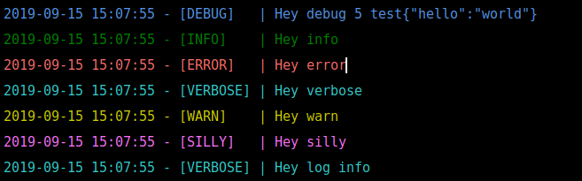

# WoodCutter

WoodCutter is a small logger based on winston and developed in TypeScript.

## Install

```bash
npm install --save woodcutter
```

## Run tests

```bash
npm run test
```

## Usage

```typescript
import {LogLevel} from '../lib/log-level.enum';
import {WoodCutter} from '../lib/woodcutter';

function main() {
  const woodcutter = new WoodCutter({
    level: LogLevel.SILLY
  });
  woodcutter.debug("Hey debug", 5, "test", {"hello": "world"});
  woodcutter.info("Hey info");
  woodcutter.error("Hey error");
  woodcutter.verbose("Hey verbose");
  woodcutter.warn("Hey warn");
  woodcutter.silly("Hey silly");
  woodcutter.log('verbose', "Hey log info");
}

main();
```

Console output:


